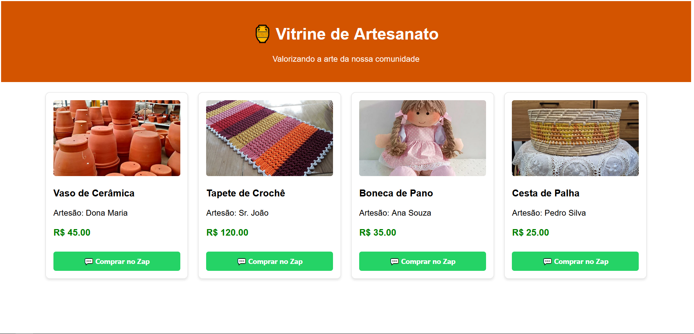
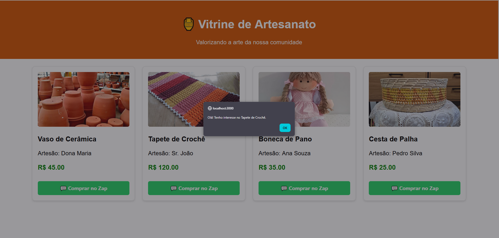

# 🏺 Vitrine de Artesanato Comunitário

## Descrição do Projeto
A **Vitrine de Artesanato Comunitário** é uma plataforma digital desenvolvida para conectar artesãos locais diretamente a seus clientes, eliminando intermediários e valorizando a economia regional. O sistema resolve o problema da falta de visibilidade digital para pequenos produtores, oferecendo uma vitrine simples e direta que facilita o início da negociação via WhatsApp.

O projeto está vinculado ao **ODS 11 (Cidades e Comunidades Sustentáveis)**, promovendo o comércio local e a sustentabilidade econômica da comunidade.

---

## 👥 Equipe de Desenvolvimento
* **Lucas de Souza Santos** (Matrícula: 2326221) - *Desenvolvedor Full Stack*
* **Gustavo Diorlando Moreira de Almeida** (Matrícula: 2323769) - *Desenvolvedor Backend / Banco de Dados*
* **Pedro Igor de Souza Costa** (Matrícula: 2323848) - *Desenvolvedor Frontend / UI*
* **Heron Verissimo de Souza** (Matrícula: 2326347) - *QA / Validação*
* **Francisco Benicio do Nascimento** (Matrícula: 2315073) - *Documentação / Integração*

---

## 🚀 Funcionalidades Implementadas

Abaixo, o status atual das funcionalidades principais do sistema:

- [x] **Vitrine de Produtos:** Listagem dinâmica de produtos com foto, título, artesão e preço.
- [x] **Integração com WhatsApp:** Botão "Comprar no Zap" que inicia a conversa direta.
- [x] **Backend API:** Endpoint `/api/products` servindo dados JSON.
- [ ] **Busca de Produtos:** (Implementação Parcial/Futura).
- [x] **Responsividade:** Layout adaptável para dispositivos móveis e desktop.

### Screenshots
| Página Inicial | Detalhe de Compra |
|:---:|:---:|
|  |  |

---

## 🛠️ Tecnologias Utilizadas

**Frontend:**
* React.js (v18.2.0)
* CSS3

**Backend:**
* Node.js & Express
* **Dados em Memória (Mock):** Utilização de arrays estáticos para simulação de persistência e garantia de funcionamento imediato do protótipo (o esquema final do banco está documentado em `database/schema.sql`).

---

## ⚙️ Instruções de Instalação e Execução

### Passo a Passo

**1. Clonar o repositório**
```bash
git clone [https://github.com/gustydev/vitrineartesanato.git](https://github.com/gustydev/vitrineartesanato.git)
cd VitrineArtesanato
````

**2. Rodar o Backend (API)**

```bash
cd backend
npm install
npm start
```

*O servidor iniciará na porta 3001. Não é necessário configurar banco de dados local.*

**3. Rodar o Frontend (Vitrine)**
Em outro terminal:

```bash
cd frontend
npm install
npm start
```

-----

## 🌐 Acesso ao Sistema

  * **Ambiente de Desenvolvimento:** `http://localhost:3000`
  * **Credenciais de Teste:** Não aplicável (acesso público sem login nesta etapa).

-----

## ✅ Validação com Público-Alvo

A validação foi realizada presencialmente com moradores locais para garantir a usabilidade e aderência ao propósito.

  * **Público-Alvo:** Ana Paula, moradora local (Aldeota/Fortaleza).
  * **Resumo do Feedback:** A participante conseguiu identificar facilmente os preços e artesãos. Elogiou a qualidade das fotos (especialmente do tapete de crochê) e considerou a função de redirecionamento para o WhatsApp ("Comprar no Zap") extremamente útil para fechar negócios rápidos.
  * **Ajustes Realizados:** O layout dos cartões foi padronizado e as imagens ajustadas para `object-fit: cover` para melhor visualização, conforme observado durante os testes.

*Para detalhes completos, evidências e fotos, consulte a pasta [`validation/`](https://www.google.com/search?q=validation/).*